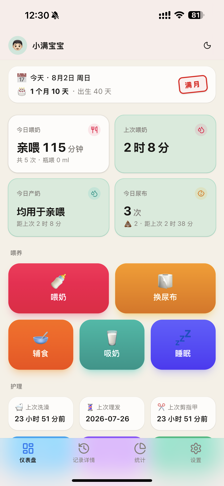
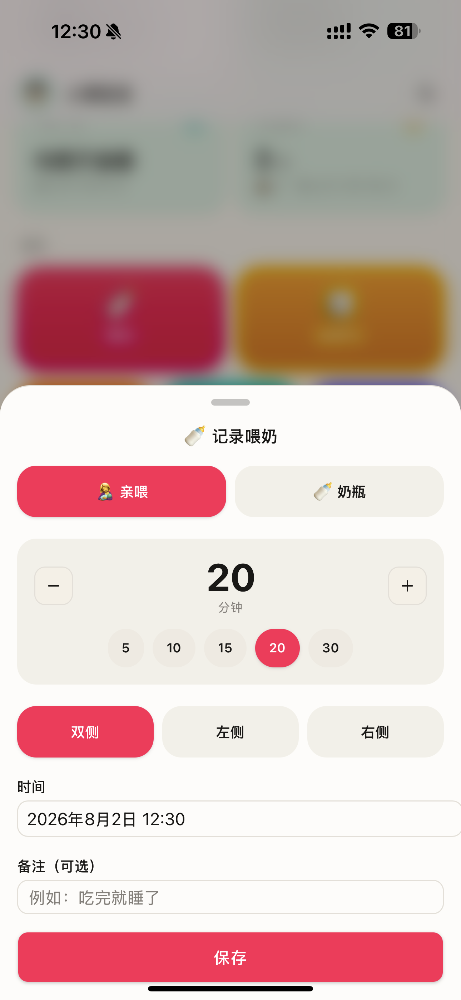
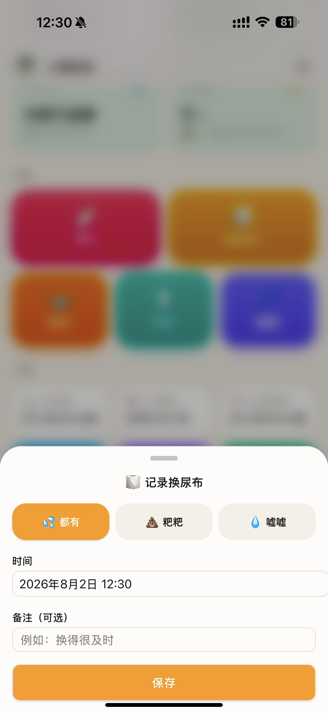
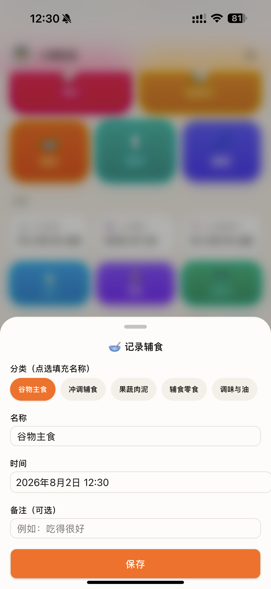
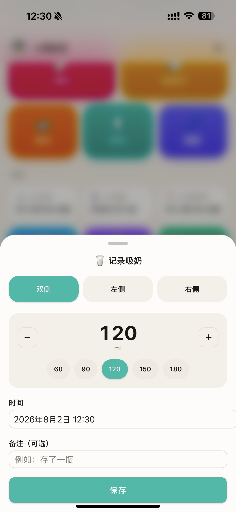
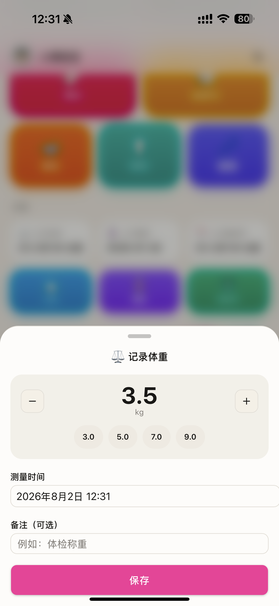
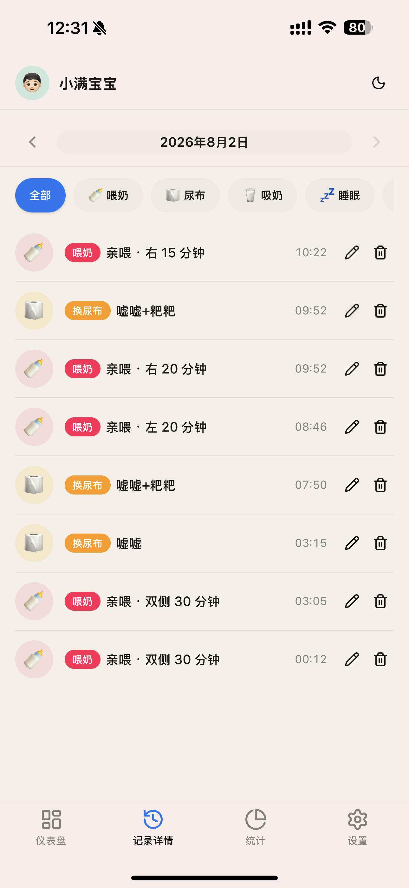
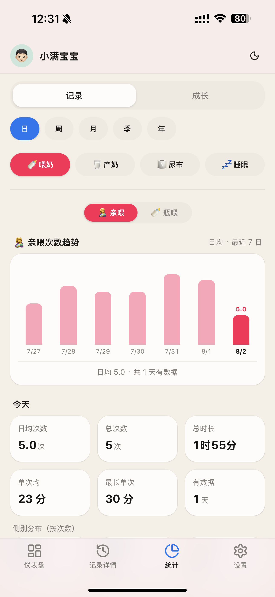
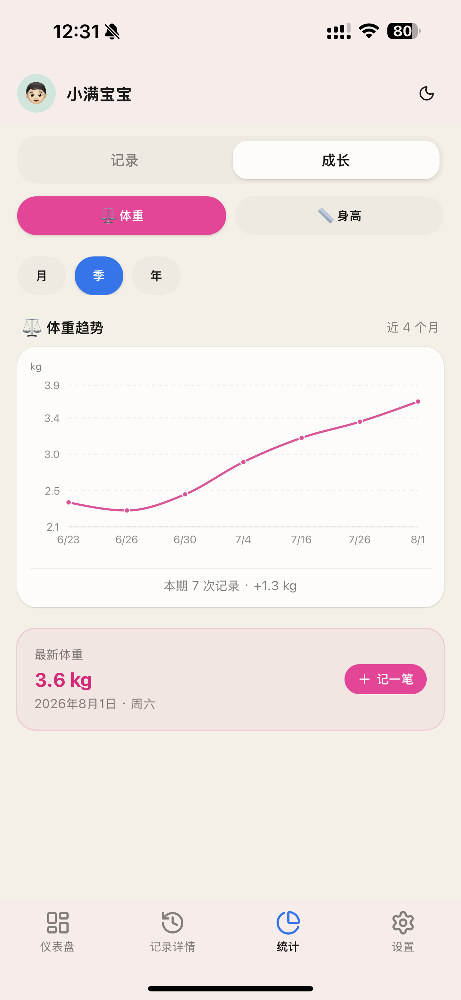

<div align="center">

# 拾光记 · Baby Tracker

为「单手抱娃、严重缺觉」的新生儿父母设计的移动优先育儿记录看板。
一键记录喂奶、换尿布、睡眠、吸奶、辅食，秒级反馈，可编辑可删除；陪伴宝宝从第一口奶到第一口辅食、每一次成长。

部署在 Cloudflare：**单个 Worker**（Next.js 经 OpenNext + Hono API + D1），全球边缘低延迟。

[功能特性](#-功能特性) · [截图预览](#-截图预览) · [技术栈](#-技术栈) · [快速开始](#-快速开始) · [部署](#-部署到-cloudflare) · [项目结构](#-项目结构)

</div>

---

## ✨ 功能特性

- **🍼 喂养记录** —— 亲喂（次数 / 时长 / 侧别）、瓶喂（母乳 / 奶粉 / 奶量）、吸奶量，三种方式一键切换
- **🥣 辅食记录** —— 5 大辅食分类快捷填充（谷物主食 / 冲调辅食 / 果蔬肉泥 / 辅食零食 / 调味与油），支持自定义名称
- **🧻 换尿布** —— 嘘嘘 / 粑粑 / 都有，快速标记
- **💤 睡眠记录** —— 手动输入时长（步长 0.5 小时，默认 2 小时），贴合带娃场景，附备注与时间，支持补记
- **🛁 护理追踪** —— 洗澡、理发、剪指甲，记录上次时间与平均间隔提醒
- **⚖️ 成长曲线** —— 体重 / 身高双指标折线图，按月 / 季 / 年查看趋势，记录每一次测量
- **💉 疫苗接种** —— 接种时间线管理，按月龄里程碑提醒
- **📊 数据统计** —— 喂奶量、亲喂次数、尿布、睡眠时长等趋势可视化，支持日 / 周 / 月 / 季 / 年粒度切换
- **🔒 访问暗号** —— 可为宝宝档案设置访问暗号，跨设备同步解锁状态
- **🌙 深色模式** —— 全局深色模式适配，夜间喂奶不刺眼
- **📱 移动优先** —— 单手盲操友好的大按钮与抽屉式表单，PWA 可装至主屏

## 📸 截图预览

<table>
  <tr>
    <td width="33.3%" align="center"><b>创建宝宝档案</b></td>
    <td width="33.3%" align="center"><b>仪表盘首页</b></td>
    <td width="33.3%" align="center"><b>记录喂奶</b></td>
  </tr>
  <tr>
    <td></td>
    <td></td>
    <td></td>
  </tr>
  <tr>
    <td width="33.3%" align="center"><b>记录辅食</b></td>
    <td width="33.3%" align="center"><b>统计 · 记录</b></td>
    <td width="33.3%" align="center"><b>统计 · 成长曲线</b></td>
  </tr>
  <tr>
    <td></td>
    <td></td>
    <td></td>
  </tr>
  <tr>
    <td width="33.3%" align="center"><b>历史时间线</b></td>
    <td width="33.3%" align="center"><b>疫苗接种</b></td>
    <td width="33.3%" align="center"><b>深色模式</b></td>
  </tr>
  <tr>
    <td></td>
    <td></td>
    <td></td>
  </tr>
</table>

## 🧰 技术栈

| 层 | 技术 |
| --- | --- |
| **前端** | Next.js 16 (App Router) · React 19 · TypeScript · Tailwind v4 · shadcn UI · Lucide · Recharts |
| **后端** | Hono（`/api/[[...route]]` 边缘路由）· `@hono/zod-validator` 参数校验 |
| **数据库** | Cloudflare D1 (SQLite) · Drizzle ORM |
| **部署** | `@opennextjs/cloudflare` —— 输出单个 Worker + 静态资源 |
| **数据流** | SWR（乐观更新）· Sonner（Toast）· next-themes（暗黑模式） |

## 🚀 快速开始

> 前置：Node.js ≥ 20，包管理器推荐 pnpm（脚本以 npm 为例，pnpm 等价）

```bash
# 1. 安装依赖
pnpm install

# 2. 初始化本地 D1 数据库（应用迁移到 .wrangler/state）
pnpm db:migrate:local

# 3. 启动开发服务器
pnpm dev
```

打开 http://localhost:3000 即可使用。

> `next dev` 通过 `initOpenNextCloudflareForDev()` 自动把 `wrangler.jsonc` 中的 D1 绑定注入到 `getCloudflareContext()`，本地开发即拥有真实 D1。
> 若要跑真实的 Worker bundle，使用 `pnpm preview`（OpenNext build + wrangler dev）。

## ☁️ 部署到 Cloudflare

```bash
# 1. 登录 Cloudflare
npx wrangler login

# 2. 创建 D1 数据库，把返回的 database_id 填入 wrangler.jsonc
npx wrangler d1 create baby-trace-db

# 3. 应用迁移到远端 D1
pnpm db:migrate:remote

# 4. 构建并部署
pnpm deploy
```

## 📂 项目结构

```
app/
  [name]/            # 以宝宝名字为 URL 的应用页
    page.tsx         #   仪表盘（今日概览 + 快速记录 + 时间线）
    history/         #   历史记录（按日分组）
    stats/           #   统计（记录趋势 + 成长曲线）
    manage/          #   宝宝档案管理
  api/[[...route]]/  # Hono 挂载点（getCloudflareContext → D1）
server/
  app.ts             # Hono 装配 + 全局错误处理
  schema.ts          # Drizzle 表定义
  inputs.ts          # Zod 校验 schema
  routes/            # babies · logs · measurements · vaccines · stats · sleep
  lib.ts             # toLog / nowSec / 访问暗号哈希
components/
  dashboard/         # 仪表盘组件（今日概览 / 快速记录 / 时间线）
  log-entry/         # 各类记录抽屉（喂奶 / 尿布 / 吸奶 / 护理 / 睡眠 / 辅食 / 测量）
  stats/             # 统计图表（趋势柱图 / 成长折线 / 指标明细）
  ui/                # shadcn UI 基础组件
lib/
  api-client.ts      # hono/client 端到端类型化
  hooks.ts           # SWR 数据 hooks
  mutations.ts       # 乐观更新 mutations
  activity.ts        # 活动类型元数据（配色 / 图标 / 描述）
drizzle/             # 迁移 SQL（也是 wrangler migrations_dir）
```

## 🗃️ 数据模型

单表多类型设计——所有活动记录存于 `baby_logs`，用 `activity_type` 区分：

| 字段 | 说明 |
| --- | --- |
| `activity_type` | `feed` 喂奶 · `diaper` 尿布 · `sleep` 睡眠 · `pump` 吸奶 · `bath` 洗澡 · `haircut` 理发 · `nail` 剪指甲 · `food` 辅食 |
| `start_time` / `end_time` | Unix 秒。睡眠时长 = `end - start` |
| `amount` | 奶瓶 = ml · 亲喂 = 分钟 · 吸奶 = ml |
| `details` | JSON：喂养方式 / 尿布类型 / 辅食名称等 |
| `notes` | 备注（可选） |

测量（体重 / 身高）与疫苗接种为独立表，结构差异较大。

色彩约定：喂奶 = rose · 尿布 = amber · 睡眠 = indigo · 吸奶 = teal · 洗澡 = sky · 理发 = violet · 剪指甲 = emerald · 辅食 = orange（见 `lib/activity.ts`）。

## 📄 License

[MIT](./LICENSE) © 2026 Ark
